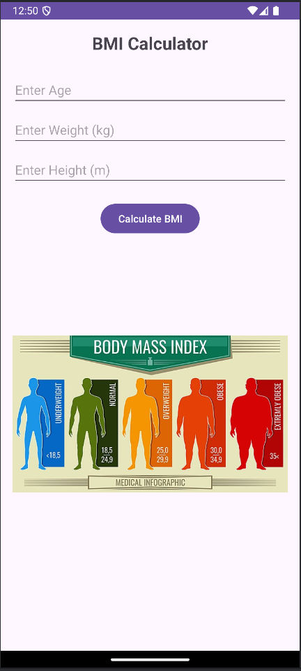
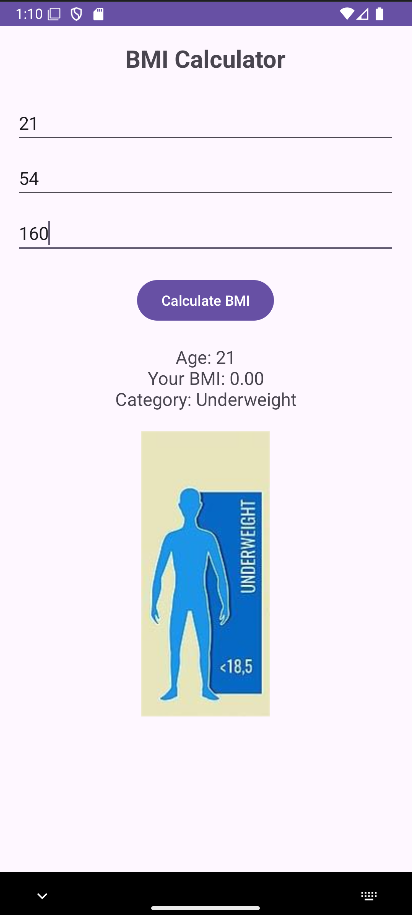

#  BMI Calculator – Android App

A simple Android application that calculates the Body Mass Index (BMI) of a user based on their height and weight. Built using **Java** and **XML** in **Android Studio**.

---

##  Features

- Enter height and weight
- Calculate BMI instantly
- Display BMI value with category:
  - Underweight
  - Normal
  - Overweight
  - Obese
- Simple and clean user interface

---

## Built With

- **Java** – Programming language
- **XML** – UI Design
- **Android Studio** – Development environment
- **Min SDK** – 21 (Android 5.0 Lollipop)

---

##  Screenshots





---

##  Installation

1. Clone the repository:
   ```bash
   git clone https://github.com/yourusername/BMI-Calculator-App.git
